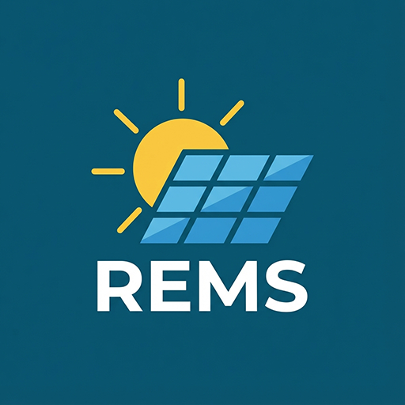

# REMS 태양광 인버터 커스텀 컴포넌트



이 Home Assistant용 커스텀 컴포넌트는 한국에너지공단(REM)의 신재생에너지 통합모니터링시스템(REMS) 표준 프로토콜을 따르는 단상 태양광 인버터를 통합합니다. RS485-to-TCP 브리지(예: Elfin-EW11)를 통해 연결하여 발전량, 전압, 전류 등을 모니터링합니다.

## 주요 기능

- **실시간 모니터링**:
  - **PV (DC) 측**: 전압, 전류, 전력.
  - **계통 (AC) 측**: 전압, 전류, 전력, 주파수, 역률.
- **에너지 트래킹**:
  - 인버터에서 총 누적 발전량을 읽어옵니다.
  - 소프트웨어로 계산된 "세션 발전량(Grid Accumulated Energy)" (Home Assistant 재시작 전까지의 발전량).
- **오류 감지**: 인버터 오류 코드를 읽기 쉬운 텍스트로 변환합니다 (예: "PV 과전압", "인버터 정지", "정상").
- **자동 재시도**: RS485-over-TCP 통신의 안정성을 위해 재시도 및 타임아웃 기능을 포함한 견고한 연결 처리를 제공합니다.

## 지원 장치

- **인버터**: 한국 REMS 표준 프로토콜을 준수하는 모든 단상 태양광 인버터.
- **통신 브리지**: TCP 서버로 설정된 RS485 to TCP/IP 서버 (예: Elfin-EW11, Elfin-EE11).

## 설치 방법

### 방법 1: HACS (권장)

1. Home Assistant에 **HACS**가 설치되어 있는지 확인하세요.
2. **HACS > Integrations**로 이동합니다.
3. 오른쪽 상단의 메뉴(점 3개)를 클릭하고 **Custom repositories**를 선택합니다.
4. 다음 저장소 URL을 추가합니다:
   ```
   https://github.com/trimmerpop/ha_solar_inverter_rems
   ```
5. 카테고리로 **Integration**을 선택하고 **Add**를 클릭합니다.
6. 목록에서 **Solar Inverter REMS**를 찾아 **Download**를 클릭합니다.
7. Home Assistant를 다시 시작합니다.

### 방법 2: 수동 설치

1. 이 저장소에서 최신 릴리스를 다운로드합니다.
2. `solar_inverter_rems` 폴더를 Home Assistant의 `custom_components` 디렉토리에 복사합니다.
   - 경로: `/config/custom_components/solar_inverter_rems`
3. Home Assistant를 다시 시작합니다.

## 설정

1. **설정 > 기기 및 서비스**로 이동합니다.
2. **+ 통합 구성요소 추가**를 클릭합니다.
3. **Solar Inverter REMS**를 검색합니다.
4. 필요한 연결 정보를 입력합니다:
   - **이름 (Name)**: 센서 접두사 (예: "Solar").
   - **IP 주소 (IP Address)**: RS485-to-TCP 브리지의 IP 주소 (예: `192.168.0.10`).
   - **포트 (Port)**: 브리지의 TCP 포트 (예: `8899`).
   - **슬레이브 ID (Slave ID)**: 인버터의 Modbus 슬레이브 ID (기본값은 보통 `1`).
   - **스캔 간격 (Scan Interval)**: 데이터 갱신 주기 (초 단위, 기본값: 600 = 10분).

> **참고**: 나중에 통합 구성요소 항목에서 **구성하기**를 클릭하여 설정을 변경할 수 있습니다.

## 센서

설정이 완료되면 다음 엔티티들을 사용할 수 있습니다 (선택한 이름이 접두어로 붙습니다):

| 엔티티 ID 접미사 | 설명 | 단위 | 클래스 |
| :--- | :--- | :--- | :--- |
| `_pv_voltage` | PV 입력 전압 | V | Voltage |
| `_pv_current` | PV 입력 전류 | A | Current |
| `_pv_power` | PV 입력 전력 | W | Power |
| `_grid_voltage` | 계통 출력 전압 | V | Voltage |
| `_grid_current` | 계통 출력 전류 | A | Current |
| `_grid_power` | 계통 출력 전력 | W | Power |
| `_grid_frequency` | AC 주파수 | Hz | Frequency |
| `_power_factor` | 역률 | % | Power Factor |
| `_total_power` | 총 누적 발전량 | kWh | Energy |
| `_grid_accumulated_energy` | 세션 발전량 (소프트웨어 계산) | kWh | Energy |
| `_inverter_fault` | 인버터 진단 상태 | - | - |

## 문제 해결

- **연결 실패 (Connection Failed)**:
  - IP와 포트가 정확한지 확인하세요.
  - RS485-to-TCP 장치가 응답하는지 확인하세요 (`ping <ip>`).
  - 브리지가 단일 클라이언트만 지원하는 경우, 다른 클라이언트(다른 HA 인스턴스나 테스트 도구 등)가 연결을 점유하고 있지 않은지 확인하세요.
- **데이터 없음 / "Inverter Off"**:
  - 밤에는 인버터가 일반적으로 꺼집니다. 통합 구성요소는 "Inverter Off"와 0 값을 표시합니다.
  - 낮 시간에도 발생한다면 물리적인 RS485 배선(A+, B-)을 확인하세요.
- **CRC 불일치 (CRC Mismatch)**:
  - 일반적으로 라인의 노이즈나 브리지와의 불안정한 무선 연결을 나타냅니다. 통합 구성요소는 자동으로 재시도합니다.

## 지원

문제가 발생하거나 기능 요청이 있는 경우 [Issues Tracker](https://github.com/trimmerpop/ha_solar_inverter_rems/issues)에 제보해 주세요.
